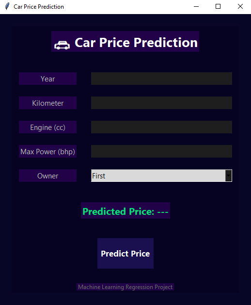
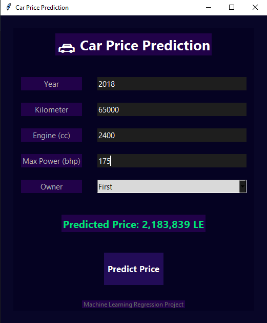

# 🚗 Car Price Prediction Using Machine Learning

<p align="center">
  
  
  
</p>

## 📌 Project Overview
This project focuses on predicting used car prices using multiple machine learning regression algorithms. The objective is to analyze vehicle-related features, compare different regression techniques, and identify the most effective model for accurate price prediction.

The best-performing model, **Random Forest Regressor**, was selected and deployed through a desktop graphical user interface (GUI) built with Tkinter.

---

## 📸 App Screenshots
<p align="center">
  
  
</p>

---

## 📝 Problem Statement
Car pricing depends on multiple technical and market-related factors such as manufacturing year, mileage, engine capacity, and drivetrain type. The goal of this project is to build predictive models capable of estimating vehicle prices based on historical data.

## 📊 Dataset Features
The model uses several key features to determine the price:
* **Vehicle Info:** Year, Kilometer, Drivetrain.
* **Engine Specs:** Engine (cc), Max Power (bhp), Max Torque.
* **Dimensions:** Length, Width, Height.
* **Capacity:** Seating Capacity, Fuel Tank Capacity.
* **Ownership:** Number of previous owners.

---

## ⚙️ Data Preprocessing
To ensure high accuracy, the following steps were taken:
1. **Data Cleaning:** Extracted numerical values from strings (e.g., removing 'cc' and 'bhp').
2. **Imputation:** Filled missing values using **Median** (for numerical) and **Mode** (for categorical) data.
3. **Encoding:** Applied **One-Hot Encoding** to handle categorical variables like Drivetrain.
4. **Scaling:** Used **StandardScaler** to normalize data for distance-based algorithms like KNN and SVR.

---

## 🤖 Models Implemented & Results
We experimented with several regression algorithms to find the best fit:

| Algorithm | R² Score (Test) | RMSE |
| :--- | :---: | :---: |
| **Random Forest Regressor** | **0.826** | **1,100,096** |
| Decision Tree Regressor | 0.861 | 983,023 |
| Linear Regression | 0.644 | 1,576,943 |
| KNN Regressor | 0.548 | 1,775,224 |
| Support Vector (SVR) | -0.11 | 2,793,228 |

> **Note:** Although Decision Tree had a slightly higher R², Random Forest was chosen for deployment as it showed better generalization and less overfitting.

---

## 🛠️ Technologies Used
* **Language:** Python
* **Libraries:** Pandas, NumPy, Scikit-learn, Joblib
* **GUI Framework:** Tkinter
* **Version Control:** Git & GitHub

---

## 🚀 How to Run the Project
1. **Clone the repository:**
   ```bash
   git clone [https://github.com/Elzlytny/car-price-prediction.git](https://github.com/Elzlytny/car-price-prediction.git)
2. **Install dependencies:**
   ```bash
   pip install -r requirements.txt
3. **Run the Application:**
   ```bash
   python src/gui.py

  ---
  
  👤 Author
Mohammed Elzlytny Junior Penetration Tester | Computers & AI Student

<p align="center"> ⭐ If you like this project, feel free to star the repository! </p>
